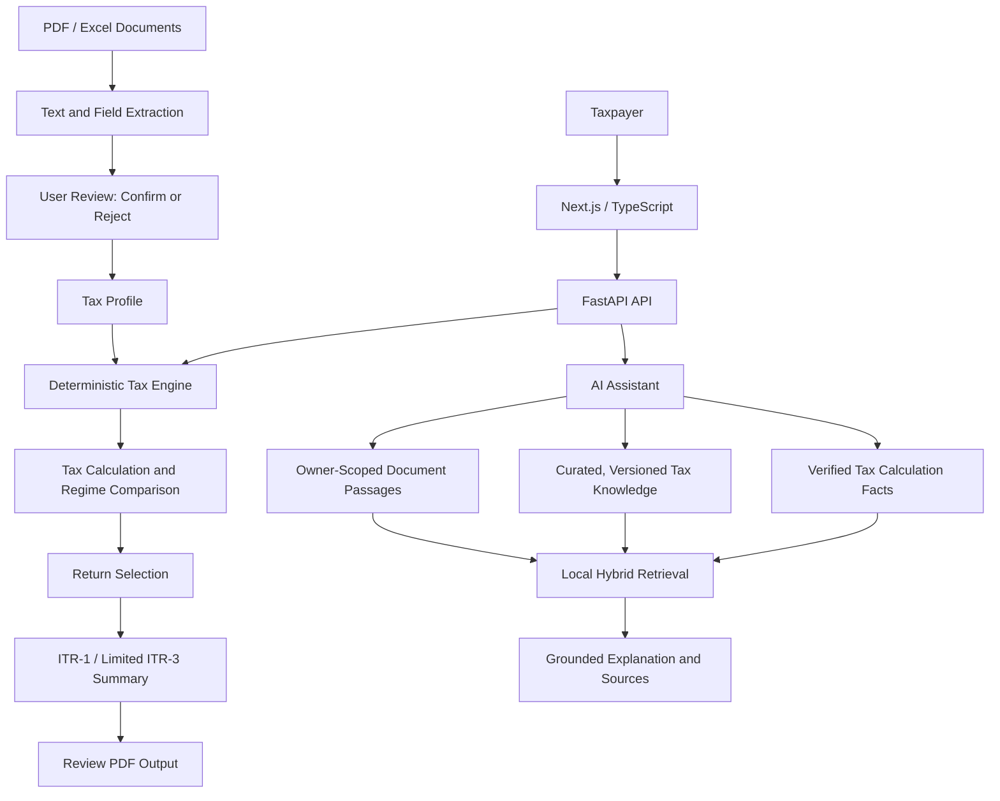

# TaxWise

TaxWise is an AI-assisted tax-preparation application for supported Indian individual-tax scenarios. It combines a deterministic tax engine with a versioned structured tax knowledge base and document-assisted extraction. Numerical tax results come from the engine, not the language model.

## Current Scope

- Tax-profile management and deterministic old/new regime calculations for AY 2026-27.
- Supported salary, pension, house-property, other-income, deduction, tax-payment, and implemented capital-gain calculation scenarios. Business-income calculations are available only through the expanded calculation path and use user-entered net profit.
- Chat explanations grounded in calculation results and retrieved assessment-year notes. Unsupported tax questions are declined when no matching knowledge is available.
- PDF and Excel extraction into candidate fields. Candidates require explicit review and confirmation before they update the tax profile. Scanned-PDF OCR is attempted only when the Tesseract executable is installed.
- General return-family selection with reasons and limitations. ITR-1 preparation and a limited ITR-3 business-income review summary with PDF output are implemented. ITR-2 and ITR-4 preparation, full statutory ITR-3 schedules, and filing are not.

The application does not submit returns, e-verify, connect to government or bank systems, or guarantee tax outcomes. Review profile data and current rules with a qualified professional before filing.

## Architecture



ITR-2/4 preparation, full statutory ITR-3 schedules, government filing, a runtime admin console for publishing additional shared source documents, and expanded document understanding are future work; they are not shown as active flows. The shared reference corpus is reviewed knowledge checked into `backend/knowledge/`; private taxpayer uploads are never shared.

## Run Locally

Prerequisites: Python 3.10+, Node.js 18+, and PostgreSQL (or the provided Docker Compose setup).

Backend:

```powershell
cd backend
python -m venv .venv
.\.venv\Scripts\Activate.ps1
pip install -r requirements.txt
python main.py
```

Frontend, in another terminal:

```powershell
cd frontend
npm install
npm run dev
```

The frontend runs at `http://localhost:3000`; the API and OpenAPI page run at `http://localhost:8000` and `http://localhost:8000/docs`. Configure `DATABASE_URL`, `SECRET_KEY`, `ALLOWED_ORIGINS`, and optionally `GITHUB_MODELS_TOKENS` in the backend environment. Without a model provider, verified deterministic answers and local knowledge excerpts remain available.

## Validation

```powershell
cd backend
python -m pytest
cd ..\frontend
npm run type-check
npm run build
```

Automated tests exercise implemented behavior; they are not evidence of universal or real-world tax accuracy.

## Project Guides

- [Research overview and paper-writing reference](docs/RESEARCH_OVERVIEW.md)
- [Developer and architecture guide](docs/dev-guide.md)
- [API reference](docs/API.md)
- [Tax engine rules and scope](docs/TAX_ENGINE.md)
- [Document extraction and review](docs/DOCUMENT_INTELLIGENCE.md)
- [ITR-1 preparation scope](docs/ITR1.md)
- [Return selection and future preparation scope](docs/ITR2_3.md)
- [Setup guide](docs/SETUP.md)