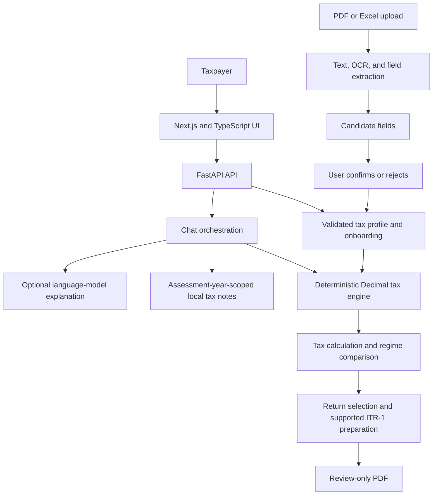

# TaxWise: Research and System Overview

This document summarizes the implemented TaxWise prototype as a reference for a project report or research paper. It describes the repository's current behavior, not a claim of certified tax accuracy, production readiness, or official filing capability. For tax-law statements, validate the active rules and cited government sources for the relevant assessment year before publication.

## Project at a Glance

- **Project name:** TaxWise
- **System type:** Web-based, AI-assisted Indian individual-tax calculation and preparation prototype
- **Active assessment year:** AY 2026-27 (FY 2025-26)
- **Primary design principle:** Deterministic code calculates tax; retrieval and optional generative AI help explain supported results.

### Paper-Ready Abstract

TaxWise is a web application prototype intended to help individual taxpayers organize tax-profile information, examine supported Indian income-tax scenarios, compare tax regimes, and review a limited return-preparation workflow. Its architecture combines a deterministic Python tax engine with Decimal-based arithmetic and assessment-year-specific rule modules, a local lexical retrieval system over versioned tax notes, and document-assisted extraction that stages candidate values for user review. An optional language-model integration can phrase explanations from verified calculation facts and relevant knowledge notes, while tax amounts and eligibility decisions remain controlled by application rules. The system also includes authenticated profile management, guided onboarding, regime comparison, what-if scenarios, return-family selection, and ITR-1 preparation with a review PDF. The current implementation is limited to AY 2026-27 and does not file returns or connect to government or financial institutions. Repository tests cover selected engine, API, extraction, and workflow cases; they do not establish population-level tax accuracy, usability, or production readiness.

### Keywords

Indian income tax; tax calculation; explainable software; deterministic rules engine; retrieval-augmented assistance; document information extraction; human-in-the-loop review; return preparation.

## Problem and Motivation

Individual tax workflows require users to collect financial facts, understand regime-specific rules, interpret deductions and tax payments, and prepare information for a return. General-purpose language models can produce fluent explanations, but their generated calculations and legal interpretations are not dependable sources of numeric truth. Tax documents also contain semi-structured information that may be difficult to enter manually, while automatic extraction can misread fields.

TaxWise addresses these software-design challenges by separating calculation, knowledge retrieval, language generation, and document extraction. Tax calculations are performed by explicit rules. Retrieved notes are assessment-year scoped. Extracted fields remain candidates until a user reviews and confirms them. These controls are architectural choices; their effectiveness has not yet been measured in a formal user or accuracy study.

## Research Framing

Possible research questions for a paper based on this implementation are:

1. How can deterministic tax rules and language-model explanations be separated so that generated prose cannot alter calculated tax values?
2. How can assessment-year-scoped tax knowledge and explicit out-of-scope handling constrain a tax assistant's answers?
3. How can document extraction be incorporated into a tax profile while retaining user control over uncertain values?
4. What additional evaluation is needed before such a prototype can be used for real filing decisions?

These are research questions suggested by the system design, not findings demonstrated by the repository. A paper should distinguish implemented mechanisms from measured outcomes.

## System Architecture



### Technology Stack

| Layer | Implementation |
|---|---|
| Web application | Next.js 14, React 18, TypeScript |
| Client state and API calls | Zustand, Axios, cookie-based access-token persistence |
| API | Python, FastAPI, Pydantic schemas |
| Persistence | SQLAlchemy ORM; database URL configured through backend settings |
| Tax computation | Python `Decimal`, explicit calculation modules, AY-specific rule package |
| PDF text extraction and output | `pypdf` for text extraction; ReportLab for review-PDF generation |
| Spreadsheet extraction | `openpyxl` |
| OCR fallback | PyMuPDF and `pytesseract`; Tesseract executable must be installed separately |
| Optional explanation generation | GitHub Models-compatible OpenAI client configuration |
| Automated tests | pytest for backend; TypeScript compiler check and Next.js build for frontend |

## Main Components and Workflows

### 1. Authentication and Tax Profile

Users sign up or log in and use bearer-token-protected APIs. A validated tax profile stores assessment year, taxpayer facts, income, deductions, taxes paid, bank details, and document metadata. Frontend auth state is hydrated from the persisted token on application load. Profile ownership is checked by authenticated APIs.

### 2. Conversational Onboarding

Onboarding is a deterministic guided flow over the same tax profile used by the forms; it is not a separate source of tax facts. The workflow tracks the current field, completed and skipped fields, missing information, answers, and a pending candidate. Amounts are parsed as `Decimal` and profile schemas validate data before persistence. A candidate is not saved until the user confirms it.

### 3. Tax Calculation and Regime Comparison

The calculation flow aggregates supported profile income, applies regime-specific deductions, calculates ordinary taxable income and applicable special-rate capital-gain tax, then applies rebate, surcharge, cess, rounding, and tax-payment reconciliation. Old- and new-regime calculations are returned separately; the comparison recommendation is based on the resulting liability. Structured errors are returned for unsupported years, missing required facts, or unsupported inputs instead of silently assuming values.

The AY 2026-27 rules include supported salary, pension, other-source and house-property scenarios, selected deductions, selected capital-gain transaction types, and a limited expanded path for user-entered business net profit. Exact rules and boundaries are documented in [TAX_ENGINE.md](TAX_ENGINE.md). Capital-gain or business-income calculation support does not imply that the corresponding return forms can be prepared.

### 4. Tax Assistant and Knowledge Retrieval

The chat route distinguishes personal calculation questions from general tax questions. For personal questions it uses the saved profile and deterministic tax engine. General explanations can use local Markdown notes selected by lexical matching and filtered by assessment year. Retrieval is not embedding-based vector search; it does not search uploaded documents or synchronize tax law from external sources.

When configured, a language model may generate prose from structured calculation facts and relevant notes. The implementation screens its answer and falls back to the deterministic explanation if the provider fails or the answer fails checks. The model does not own the calculation or return-eligibility decision. When no supported answer is available, the application can decline rather than invent a rule. Provider configuration and data handling should be reviewed before using real taxpayer data.

### 5. Document-Assisted Extraction

Authenticated users can upload PDF, `.xlsx`, and `.xlsm` documents within the configured 10 MB limit. The system extracts text, applies supported labels and parsing rules, and stores candidate values for review. OCR is attempted for PDFs without extractable text when Tesseract is available. Spreadsheet data uses `openpyxl` and the same candidate rules.

Extraction does not immediately mutate the tax profile. The user confirms or rejects the candidate set, after which confirmed values are validated and merged. Field recognition is pattern-based, not a general-purpose document-understanding model. Candidate review is currently at the mapped-set level, rather than per-field editing. Files are stored in temporary local storage, which is not a production retention or protected-storage design.

### 6. Return Selection and ITR-1 Preparation

Return selection evaluates a profile and can identify ITR-1, ITR-2, ITR-3, or ITR-4 scenarios with reasons, missing information, and unsupported conditions. Only the supported AY 2026-27 ITR-1 preparation path is implemented. Requests for unsupported preparation paths are not silently converted into ITR-1. ITR-1 output includes a calculation-backed review summary and a PDF; it is not an official filing form, submission, acknowledgement, or e-verification.

## Scope and Limitations

- Only AY 2026-27 is implemented. Tax law and annual rules can change; results require review against current official guidance.
- Supported profile inputs and calculation branches are finite. This is not a complete implementation of every tax provision or taxpayer scenario.
- ITR-2, ITR-3, and ITR-4 preparation is not implemented, even where return-family selection can identify one of those families.
- The product does not file or submit returns, e-verify, produce official acknowledgements, or connect to government, bank, AIS, or Form 26AS systems.
- Business-income calculation uses constrained user-entered facts and does not compute books, expenses, depreciation, or complete statutory schedules.
- Foreign-income and foreign-asset schedules, persistent loss-history management, and several complex return schedules are outside scope.
- Document extraction can be incomplete or incorrect. OCR needs a separately installed Tesseract executable. Uploaded files currently use temporary local storage.
- Knowledge retrieval is lexical and can miss paraphrases; the notes are manually maintained and are not automatically synchronized with new legislation.
- Optional external model use may involve sending structured profile/calculation context to a provider. Do not use sensitive production data until provider terms, privacy, retention, and security controls have been assessed.
- Automated tests exercise selected cases. The repository contains no representative taxpayer benchmark, independent tax-professional accuracy study, user study, or measured latency/quality results.
- The prototype has not undergone a formal security, privacy, legal-compliance, accessibility, or production-readiness audit.

## Evaluation and Reproducibility

### Existing Repository Tests

The backend tests cover selected tax-engine calculations and validation, regime comparison, chat routing and fallback, knowledge retrieval, onboarding, document extraction and review, and ITR selection/preparation boundaries. Relevant suites include `backend/tests/test_tax_engine.py`, `backend/tests/test_tax_engine_hardening.py`, `backend/tests/test_chat_api.py`, `backend/tests/test_knowledge.py`, `backend/tests/test_document_extraction.py`, `backend/tests/test_document_api.py`, and the ITR/onboarding test modules.

These tests are regression checks for encoded cases, not a statistically representative evaluation. A research paper should not report an accuracy percentage, superiority claim, or real-world user benefit unless a separate, documented evaluation has been conducted.

### Suggested Formal Evaluation

For a stronger research study, define an independently reviewed set of taxpayer scenarios and report at least:

- Calculation agreement against official worked examples or tax-professional-verified expected outputs, including per-stage discrepancies.
- Boundary and invalid-input coverage by income type, regime, deduction section, age category, and assessment year.
- Document field extraction precision, recall, and exact-match rate by document type and scan quality, with OCR availability reported.
- Knowledge retrieval relevance and answer-grounding measures, with unsupported-question refusal rate.
- Human review outcomes: candidate correction/rejection rate, completion time, and usability feedback under an approved study protocol.
- Latency and failure rates for API, OCR, and optional model-provider paths, separated from deterministic calculation performance.

Publish the test-set construction, rule-source dates, software versions, and handling of personal information. Do not include real taxpayer records without appropriate consent, minimization, access controls, and institutional/legal review.

### Local Verification

Prerequisites are Python 3.10+, Node.js 18+, and a configured database. See [SETUP.md](SETUP.md) for environment details. Standard checks are:

```powershell
cd backend
python -m pytest
cd ..\frontend
npm install
npm run type-check
npm run build
```

Set backend environment values such as `DATABASE_URL`, `SECRET_KEY`, and `ALLOWED_ORIGINS` before running the API. `GITHUB_MODELS_TOKENS` is optional; deterministic calculations and local knowledge retrieval do not require a model provider. Scanned-document OCR additionally requires the Tesseract executable. Use a fresh isolated test database for repeatable API tests.

## Suggested Paper Structure

1. **Introduction:** taxpayer workflow problem, scope, and research questions.
2. **Related Work:** tax software, rule-based expert systems, retrieval-grounded assistants, and human-in-the-loop extraction. Add literature citations from sources independently reviewed by the authors.
3. **System Requirements and Design:** AY boundary, supported inputs, safety requirements, and separation of calculation and language generation.
4. **Implementation:** frontend, API, deterministic engine, knowledge retrieval, onboarding, and extraction pipeline.
5. **Evaluation Method:** dataset construction, expected-output validation, measures, baselines, and privacy protocol.
6. **Results:** report only experiments actually performed; distinguish test pass rates from tax accuracy.
7. **Limitations and Threats to Validity:** unsupported rules, annual change, lexical retrieval, OCR errors, limited test population, provider/privacy risks, and lack of production audit.
8. **Conclusion and Future Work:** broader verified rule coverage, independent benchmarks, improved per-field review, protected storage, additional return forms, and external legal/security review.

## Repository Map

- `frontend/src/pages/` — user-facing workflows such as profile, regime comparison, documents, chat, and ITR preview.
- `backend/routes/` — HTTP endpoints and authenticated route orchestration.
- `backend/schemas/` and `backend/models/` — request/response validation and persistence models.
- `backend/tax_engine/` — calculation logic and AY-specific rules.
- `backend/services/knowledge.py` and `backend/knowledge/` — local note retrieval and assessment-year reference content.
- `backend/documents/` and `backend/services/document_processing.py` — extraction and document processing.
- `backend/itr/` — eligibility, return-family selection, ITR-1 preparation, and review-PDF generation.
- `backend/tests/` — regression coverage for selected implementation behavior.

## References and Further Reading

Project documentation:

- [Developer and architecture guide](dev-guide.md)
- [Tax engine rules and cited sources](TAX_ENGINE.md)
- [Document processing and knowledge retrieval](DOCUMENT_INTELLIGENCE.md)
- [Conversational onboarding](CONVERSATIONAL_ONBOARDING.md)
- [ITR-1 preparation scope](ITR1.md)
- [Return selection and unsupported preparation scope](ITR2_3.md)
- [API reference](API.md)

Official references already cited by the project include the [Union Budget 2025-26 Budget Speech](https://www.indiabudget.gov.in/doc/budget_speech.pdf) and Income Tax Department guidance for [AY 2026-27 salaried individuals](https://www.incometax.gov.in/iec/foportal/help/individual/return-applicable-1) and [individual business/profession cases](https://www.incometax.gov.in/iec/foportal/help/individual-business-profession). Verify these URLs, current guidance, and exact rule applicability before citing them in a submitted paper.