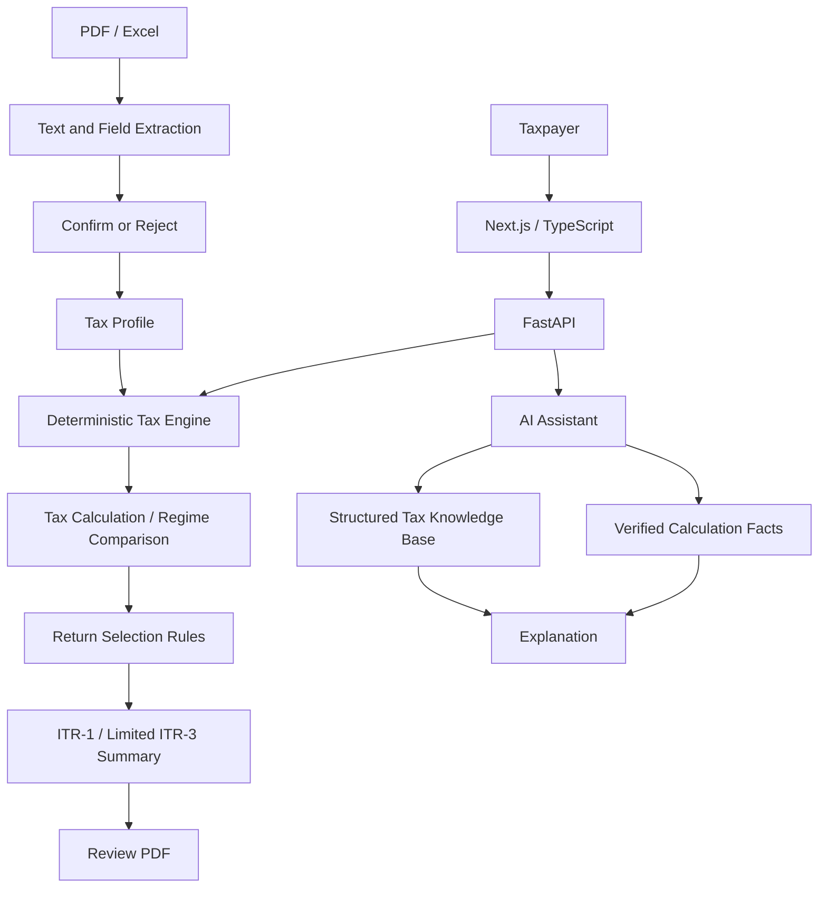

# Developer and Architecture Guide

TaxWise is a Next.js/TypeScript frontend backed by FastAPI, SQLAlchemy, and a deterministic Python tax engine. The active rule package covers AY 2026-27. `backend/main.py` registers authenticated profile, onboarding, document, deduction, chat, and return routes alongside the tax and what-if APIs.

## Active Architecture



Return selection can identify ITR-1/2/3/4 families. Preparation is supported for ITR-1 and for a constrained ITR-3 business-income review summary; full ITR-3 statutory schedules are not generated. The application does not file or submit a return.

## Implementation Inventory

### Fully implemented paths

- JWT authentication and authenticated tax-profile create/read/update/delete operations.
- Decimal-based AY 2026-27 tax calculation, old/new regime comparison, validation, rebate, surcharge, cess, rounding, and tax-payment reconciliation for the supported calculation inputs.
- Text extraction from PDFs, optional Tesseract OCR fallback when the executable is installed, and extraction from supported Excel workbooks. Extracted values are candidates, not profile facts.
- User-confirmed or rejected document candidates, with the review result stored on the document and confirmed values merged into the profile.
- General return-family selection with reasons, missing information, and unsupported conditions; ITR-1 preparation and a constrained ITR-3 business-income review summary with review-only PDF generation.

### Partially implemented paths

- Chat combines deterministic answers with an optional model-generated explanation. The model receives read-only verified results and matching AY knowledge; its answer is screened, and deterministic results remain the fallback.
- The knowledge base is checked-in Markdown with JSON metadata and lexical word-overlap retrieval. It is connected to chat, but it does not use embeddings, vector search, user-document indexing, or external tax-law synchronization.
- ITR-2 and ITR-4 are selection outcomes only. ITR-3 preparation is limited to non-presumptive profiles with non-negative user-entered net profit; books, expenses, depreciation, and statutory business schedules are not available.

### Prototypes and future work

- The lexical knowledge retriever is intentionally small; matching may miss paraphrases. Review notes against the referenced engine rules and source documents when updating them.
- Scanned PDF OCR depends on an externally installed Tesseract binary. OCR can fail when that binary is unavailable or cannot read the document.
- E-filing, e-verification, official acknowledgements, complete statutory return schedules, persistent loss ledgers, and government/bank integrations are not implemented.

## Backend Ownership

- `backend/routes/` — HTTP validation, authentication dependencies, and response mapping.
- `backend/services/knowledge.py` — versioned local tax-note retrieval for chat.
- `backend/services/onboarding.py` — conversational profile collection and candidate-state rules.
- `backend/documents/` — PDF/Excel extraction and field candidates.
- `backend/itr/` — return selection, ITR-1 and limited ITR-3 preparation summaries, and PDF output.
- `backend/tax_engine/` — calculation logic and assessment-year rule packages. Monetary arithmetic remains `Decimal`-based.
- `backend/models/` and `backend/schemas/` — persisted entities and validated API contracts.

## Frontend Workflows

- `/tax-profile` edits the saved profile and can initiate document extraction.
- `/documents` lists uploads and provides the explicit candidate review step.
- `/compare-regimes` shows both deterministic results and expandable calculation details.
- `/taxwise` sends chat questions and displays returned knowledge-note sources.
- `/itr-preview` loads a supported ITR-1 or limited ITR-3 preparation summary. Profiles outside those scopes receive an API explanation rather than another form's preview.

## Tests and Checks

Backend tests are in `backend/tests/` and cover tax calculations, API behavior, chat, knowledge lookup, extraction, document review, and return selection/preparation boundaries.

```powershell
cd backend
python -m pytest
cd ..\frontend
npm run type-check
npm run build
```

Passing automated tests demonstrate only the exercised cases. They do not establish overall tax accuracy or production readiness.